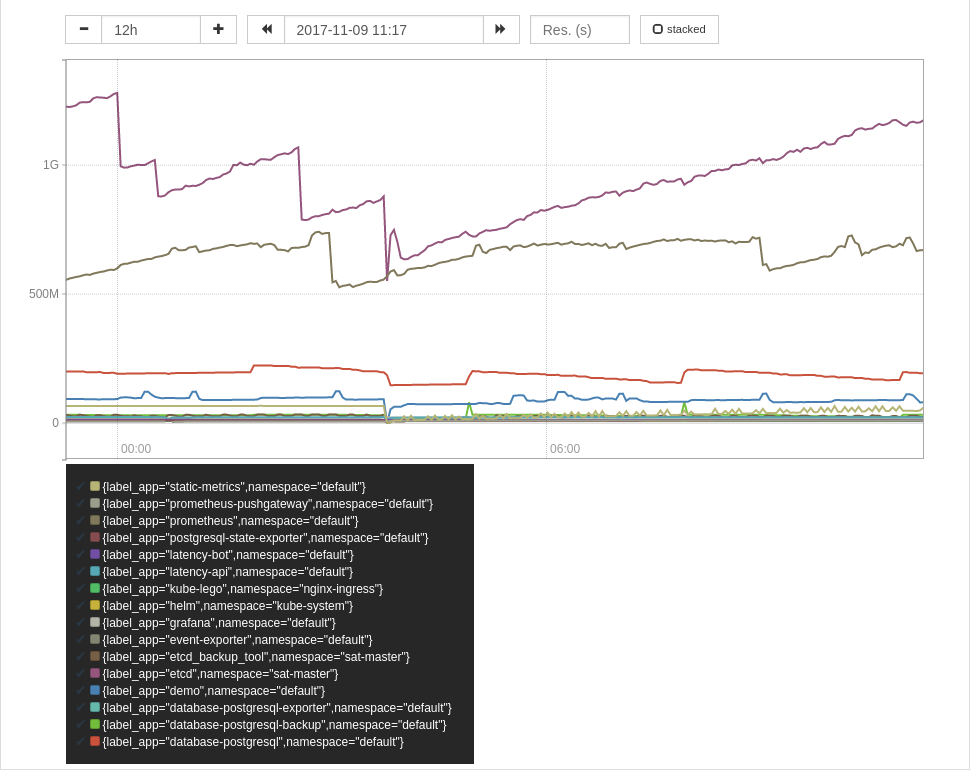
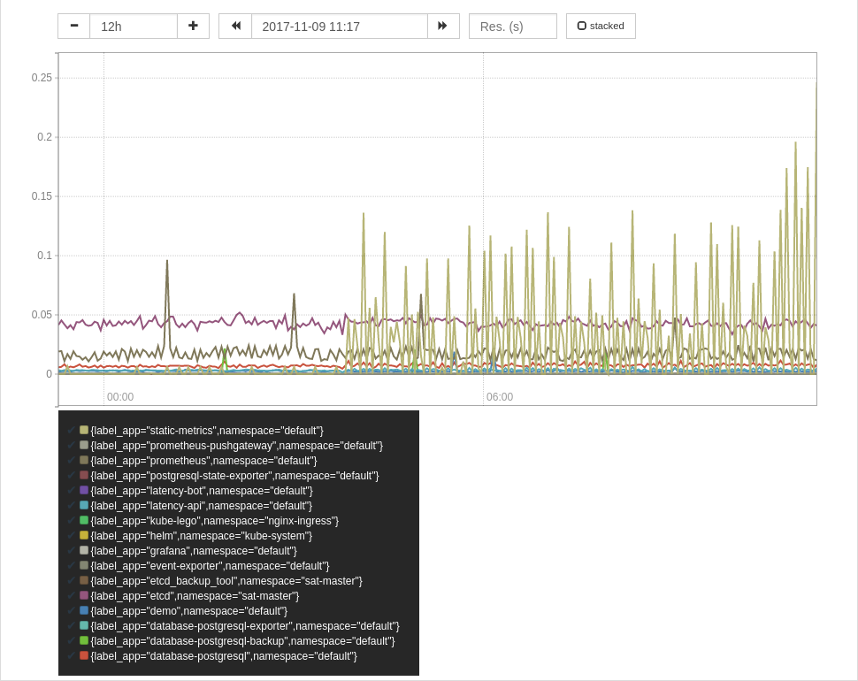
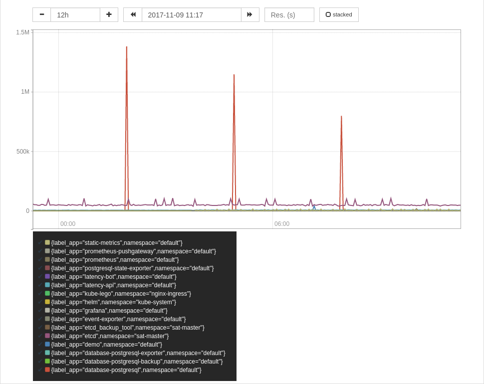

Prometheus was designed for dynamic environments like Kubernetes. Its powerful
service discovery and query language allows you to answer all kind of questions
that come up while operating a Kubernetes cluster.

This flexibility comes with a somewhat steeper learning curve than some
alternatives and hosted services, with [Vector
Matching](https://prometheus.io/docs/prometheus/latest/querying/operators/#vector-matching)
being one of the more advanced topics.

I'm not going into the details which the excellent [Prometheus
Documentation](https://prometheus.io/docs/prometheus/latest/querying/operators/#vector-matching)
has already covered but walk you through some useful queries to get resource
utilization in a Kubernetes cluster.

## Aggregated memory usage per label
Kubernetes provides a `container_memory_usage_bytes` metric reflecting each pods
memory usage, e.g:

```
...
container_memory_usage_bytes{beta_kubernetes_io_arch="amd64",beta_kubernetes_io_fluentd_ds_ready="true",beta_kubernetes_io_instance_type="g1-small",beta_kubernetes_io_os="linux",cloud_google_com_gke_nodepool="small-preemptible",cloud_google_com_gke_preemptible="true",container_name="POD",failure_domain_beta_kubernetes_io_region="us-east1",failure_domain_beta_kubernetes_io_zone="us-east1-c",id="/kubepods/burstable/pod13d4221c-c484-11e7-bff5-42010af0018b/67e5bb069ab9881ff8a55b8628ef4935b0d1ace09c18df20db059522bdfd5b7d",image="gcr.io/google_containers/pause-amd64:3.0",instance="gke-latency-at-small-preemptible-0c981b61-9489",job="kubernetes-cadvisor",kubernetes_io_hostname="gke-latency-at-small-preemptible-0c981b61-9489",name="k8s_POD_latency-api-971504058-jzs5h_default_13d4221c-c484-11e7-bff5-42010af0018b_0",namespace="default",pod_name="latency-api-971504058-jzs5h"}	389120
container_memory_usage_bytes{beta_kubernetes_io_arch="amd64",beta_kubernetes_io_fluentd_ds_ready="true",beta_kubernetes_io_instance_type="g1-small",beta_kubernetes_io_os="linux",cloud_google_com_gke_nodepool="small-preemptible",cloud_google_com_gke_preemptible="true",container_name="POD",failure_domain_beta_kubernetes_io_region="us-east1",failure_domain_beta_kubernetes_io_zone="us-east1-c",id="/kubepods/burstable/pod81d0f651-c500-11e7-bff5-42010af0018b/309e05b118e618122c70ccf88538d13ca41c3b5a770d5d67882426854391c23c",image="gcr.io/google_containers/pause-amd64:3.0",instance="gke-latency-at-small-preemptible-0c981b61-9489",job="kubernetes-cadvisor",kubernetes_io_hostname="gke-latency-at-small-preemptible-0c981b61-9489",name="k8s_POD_latency-api-971504058-gszpw_default_81d0f651-c500-11e7-bff5-42010af0018b_0",namespace="default",pod_name="latency-api-971504058-gszpw"}	372736
container_memory_usage_bytes{beta_kubernetes_io_arch="amd64",beta_kubernetes_io_fluentd_ds_ready="true",beta_kubernetes_io_instance_type="g1-small",beta_kubernetes_io_os="linux",cloud_google_com_gke_nodepool="small-preemptible",cloud_google_com_gke_preemptible="true",container_name="latency-api",failure_domain_beta_kubernetes_io_region="us-east1",failure_domain_beta_kubernetes_io_zone="us-east1-c",id="/kubepods/burstable/pod13d4221c-c484-11e7-bff5-42010af0018b/497e6fdf2217771cb3f52e6fef93734d023f0e7f23f92c58d22139fc18dc5f13",image="registry.gitlab.com/latency.at/latencyat@sha256:8ea057e064b64cc9c8459a68ef3f6d0fc26169b4f57aef193831779e1fe713d4",instance="gke-latency-at-small-preemptible-0c981b61-9489",job="kubernetes-cadvisor",kubernetes_io_hostname="gke-latency-at-small-preemptible-0c981b61-9489",name="k8s_latency-api_latency-api-971504058-jzs5h_default_13d4221c-c484-11e7-bff5-42010af0018b_1",namespace="default",pod_name="latency-api-971504058-jzs5h"}	11014144
container_memory_usage_bytes{beta_kubernetes_io_arch="amd64",beta_kubernetes_io_fluentd_ds_ready="true",beta_kubernetes_io_instance_type="g1-small",beta_kubernetes_io_os="linux",cloud_google_com_gke_nodepool="small-preemptible",cloud_google_com_gke_preemptible="true",container_name="latency-api",failure_domain_beta_kubernetes_io_region="us-east1",failure_domain_beta_kubernetes_io_zone="us-east1-c",id="/kubepods/burstable/pod81d0f651-c500-11e7-bff5-42010af0018b/7b438a8e9df0cf1ab29d067fd36c97099f9f5e7e9257f6187c5be6bff846a62c",image="registry.gitlab.com/latency.at/latencyat@sha256:8ea057e064b64cc9c8459a68ef3f6d0fc26169b4f57aef193831779e1fe713d4",instance="gke-latency-at-small-preemptible-0c981b61-9489",job="kubernetes-cadvisor",kubernetes_io_hostname="gke-latency-at-small-preemptible-0c981b61-9489",name="k8s_latency-api_latency-api-971504058-gszpw_default_81d0f651-c500-11e7-bff5-42010af0018b_0",namespace="default",pod_name="latency-api-971504058-gszpw"}	11448320
...
```

Unfortunately it doesn't contain the pod labels. For that there is the
`kube_pod_labels` though which includes a static timeseries with all labels and
the pod name. This metric is provided by
[kube-state-metrics](https://github.com/kubernetes/kube-state-metrics).

We can use it to look up the labels for the pod from the
timeseries (`pod_name="latency-api-971504058-jzs5h"`):

```
kube_pod_labels{instance="10.116.0.12:8080",job="kubernetes-service-endpoints",k8s_app="kube-state-metrics",kubernetes_name="kube-state-metrics",kubernetes_namespace="kube-system",label_app="latency-api",label_pod_template_hash="971504058",namespace="default",pod="latency-api-971504058-jzs5h"} 1
kube_pod_labels{instance="10.116.1.26:8080",job="kubernetes-service-endpoints",k8s_app="kube-state-metrics",kubernetes_name="kube-state-metrics",kubernetes_namespace="kube-system",label_app="latency-api",label_pod_template_hash="971504058",namespace="default",pod="latency-api-971504058-jzs5h"} 1
```

Both metrics can be merged by using vector matching. We get this metric twice
because there are two instances of kube-state-metrics running. So before we
continue further, we aggregate both. Since they should be identical, we can use
min/max to aggregate. Since we later want to aggregate on `label_app`, we need
to keep that label. We also need to keep the `pod` label to join both metrics
on. We can preserve them by specifying them in the BY clause. Since the pod
label is called `pod` in `kube_pod_labels` but `pod_name` in
`container_memory_usage_bytes`, we need to also use label_replace to rename the
label. This gives us:

```
max by (pod_name,label_app) (
  label_replace(kube_pod_labels{label_app!=""},"pod_name","$1","pod","(.*)")
)
```

Which returns something like:

```
...
{label_app="latency-api",pod_name="latency-api-971504058-n8k6d"}  1
{label_app="latency-api",pod_name="latency-api-971504058-jzs5h"}  1
...
```

Now we can use vector matching to join `container_memory_usage_bytes` with the
result of our expression. We use the `*` operator which effectivly is a no-op
since it will multiply the memory usage by the matched timeseries value in
`kube_pod_labels` which is always 1.

We need to specify `group_left` because there are multiple
`container_memory_usage_bytes` timeseries for each pod, one for each container.
Since we want to preserve the `label_app` label, we specify it as argument to `group_left`.

This gives us:

```
  container_memory_usage_bytes * on (pod_name) group_left(label_app)
  max by (pod_name,label_app) (
    label_replace(kube_pod_labels{label_app!=""},"pod_name","$1","pod","(.*)")
  )
```

To aggregated the memory usage of all your pods, summed by a `k8s-app` label you
can use the following expression:

```
sum by (label_app,namespace) (
  container_memory_usage_bytes * on (pod_name) group_left(label_app)
  max by (pod_name,label_app) (
    label_replace(kube_pod_labels{label_app!=""},"pod_name","$1","pod","(.*)")
  )
)
```


## CPU and IO usage per label
Now that we know how to join the `kube_pod_labels` metric with cadvisor metrics,
we can figure out usage of other resources too.

### CPU
```
sum by (label_app,namespace) (
  rate(container_cpu_usage_seconds_total[2m]) * on (pod_name) group_left(label_app)
  max by (pod_name,label_app) (
    label_replace(kube_pod_labels{label_app!=""},"pod_name","$1","pod","(.*)")
  )
)
```


### Disk IO
I wanted to show you some disk IO stats too. Unfortunately these are
[broken](https://github.com/kubernetes/kubernetes/issues/55397) once
[again](https://github.com/kubernetes/kubernetes/issues/55398) in Kubernetes.

### Network
```
sum by (label_app,namespace) (
  rate(container_network_transmit_bytes_total[2m]) * on (pod_name) group_left(label_app)
  max by (pod_name,label_app) (
    label_replace(kube_pod_labels{label_app!=""},"pod_name","$1","pod","(.*)")
  )
)
```

