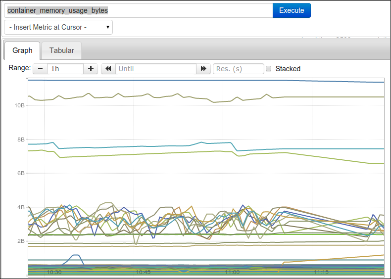
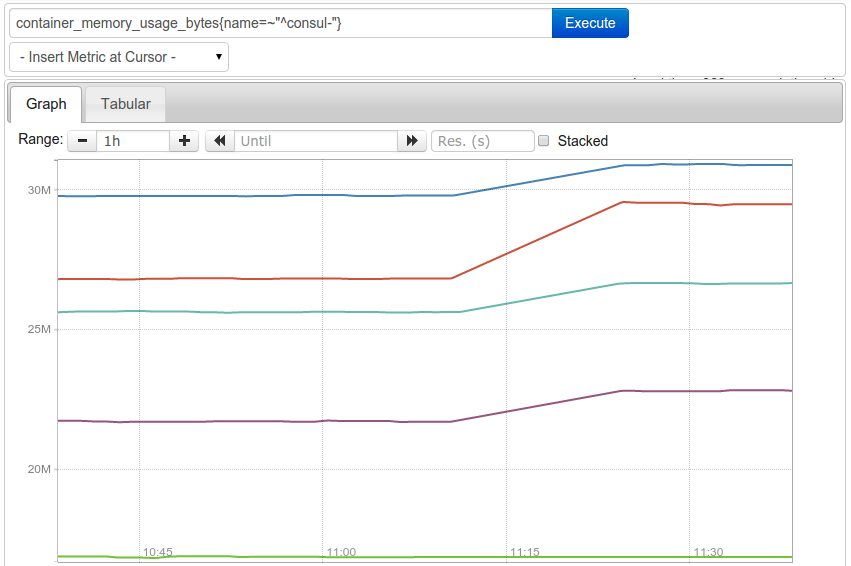
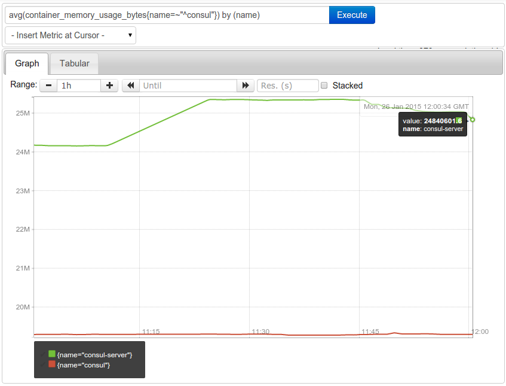

### Monitoring Docker
Running all your services in containers makes it possible to get in-depth resource and performance characteristics, since every container runs in their own cgroup and the Linux kernel provides us with all kind of useful metrics.

Although there are a few other Docker monitoring tools out there, I'll show you why I think that SoundCloud's [newly released](https://developers.soundcloud.com/blog/prometheus-monitoring-at-soundcloud) [Prometheus](https://prometheus.github.io/) is a perfect fit for monitoring container-based infrastructures.

Prometheus features a highly dimensional [data model](http://prometheus.github.io/docs/concepts/data_model/) in which a time series is identified by a metric name and a set of key-value pairs. A flexible [query language](http://prometheus.github.io/docs/querying/basics/) allows querying and graphing this data. It features advanced [metric types](http://prometheus.github.io/docs/concepts/metric_types/) like summaries, building [rates](http://prometheus.github.io/docs/querying/functions/#rate()) from totals over specified time spans or [alerting](http://prometheus.github.io/docs/querying/rules/) on any expression and has no dependencies, making it a dependable system for debugging during outages.

I will focus on why especially the data model and query language makes it such a good fit in a containerized, dynamic infrastructure where you think in clusters of services instead of single instances and servers as cattle instead of pets.

### Classic Approach
Let’s say you want to monitor the memory usage of your containers. Without support for dimensional data, such a metric for the container named `webapp123` might be called `container_memory_usage_bytes_webapp123`.

But what if you want to show the memory usage of all your `webapp123` containers? More advanced monitoring solutions like [graphite](https://github.com/graphite-project) support that. It features a hierarchic, tree-like data model in which such metric might be called `container.memory_usage_bytes.webapp123`. Now you can use wildcards like `container.memory_usage_bytes.webapp*` to graph the memory usage of all your 'webapp' containers. Graphite also supports functions like `sum()` to aggregate the memory usage of your application across all your machines by using an expression like `sum(container.memory_usage_bytes.webapp*)`.

That's all great and very useful, but limited. What if you don't want to aggregate all containers with a given name but with a given image? Or you want to compare the deployments to your canary with those on your prod machines?

It's possible to come up with a hierarchy for each use case, but not one to support them all. And reality shows, you often don't know in advance which questions you need to answer once things go dark and you start investigating.

### Prometheus
With Prometheus’s support for dimensional data, you can have global and straightforward metric names like `container_memory_usage_bytes` with multiple dimensions to identify the specific instances of your service.

I've created a simple [container-exporter](https://github.com/docker-infra/container_exporter) to gather Docker Container metrics and expose them for Prometheus to consume. This exporter uses the container's name, id and image as dimensions. Additional per-exporter dimension can be set in the `prometheus.conf`.
If you use the metric name directly as a query expression, it will return all time series with their labels for this metric name:

```
container_memory_usage_bytes{env="prod",id="23f731ee29ae12fef1ef6726e2fce60e5e37342ee9e35cb47e3c7a24422f9e88",instance="http://1.2.3.4:9088/metrics",job="container-exporter",name="haproxy-exporter-int",image="prom/haproxy-exporter:latest"}	11468800.000000
container_memory_usage_bytes{env="prod",id="57690ddfd3bb954d59b2d9dcd7379b308fbe999bce057951aa3d45211c0b5f8c",instance="http://1.2.3.5:9088/metrics",job="container-exporter",name="haproxy-exporter",image="prom/haproxy-exporter:latest"}	16809984.000000
container_memory_usage_bytes{env="prod",id="907ac267ebb3299af08a276e4ea6fd7bf3cb26632889d9394900adc832a302b4",instance="http://1.2.3.2:9088/metrics",job="container-exporter",name="node-exporter",image="prom/container-exporter:latest"}
...
...
```

If you run lot of containers, this looks something like this:



To help you make sense of this data, you can filter and/or aggregate these metrics

#### Slice & Dice
With Prometheus’s query language, you can slice and dice data by any dimension you want. If you're interested in all containers with a given name, you can use an expression like `container_memory_usage_bytes{name="consul-server"}`, which would show only the time series for which `name == "consul-server"`.
Prometheus also supports regular expressions, so instead of matching the full script you can do `container_memory_usage_bytes{name=~"^consul"}`, which would show something like this:



You can use any other dimension for filtering as well, so you can get metrics about all containers on a given host, in a given environment or zone.

#### Aggregation
Similar to Graphite, Prometheus supports aggregation functions but due to its dimensions this gets even more powerful. Summing up the memory usage of all your "consul-*" works as expected with `sum(container_memory_usage_bytes{name=~"^consul"})`.

Now let’s say you want to see the difference in average memory usage between your 'consul' and 'consul-server' containers. This is achieved by providing the dimensions to keep in the aggregated result like this `avg(container_memory_usage_bytes{name=~"^consul"}) by (name)`:



If you have services in multiple zones and configure the zone name as an additional label pair, you can also keep that dimension to show the memory usage per name and zone by using an expression like `avg(container_memory_usage_bytes{name=~"^consul"}) by (name,zone)`.

#### Using Prometheus + Container-Exporter
As you know, I like to run everything in containers, including the container-exporter and Prometheus itself. Running the [container-exporter](https://github.com/docker-infra/container_exporter) should be as easy as this:

```
docker run -p 8080:8080 -v /sys/fs/cgroup:/cgroup \
           -v /var/run/docker.sock:/var/run/docker.sock prom/container-exporter
```

Now you need to install Prometheus. For that refer to the [official documentation](http://prometheus.github.io/docs/introduction/install/). To make Prometheus pull the metrics from the container-exporter, you need to add it as a target to the configuration. For example:

```
job: {
  name: "container-exporter"
  scrape_interval: "1m"
  target_group: {
  	labels: {
	    label: {
    		name: "zone"
        	value: "us-east-1"
	    }
        label: {
        	name: "env"
            value: "prod"
        }
    }
    target: "http://1.2.3.4:8080/metrics"
  }
}
```

Now rebuild your image as described in the documentation and start it. Prometheus should now poll your container-exporter every 60s.

### Conclusion
Because of Prometheus flexibility, its performance and minimal requirements, it's the monitoring system of my choice.
This is why I introduced Prometheus beginning last year at Docker where we use it as our primary monitoring system.
