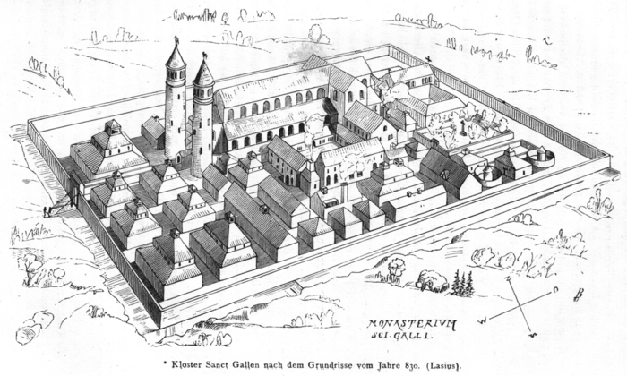

# Why?
I'm a big fan of what some might call "immutable infrastructures" which, to me, boils down to manging complexity by isolating change to specific points in the life cycle of your services.
In practice this might mean you build your application image once and just recreate it if you need to update it.
Or you install your complete server once and just recreate it if you need to update it. Where this is harder on bare metal, AWS is a nice platform for this kind of immutable servers since it supports creating and running pre-built Amazon Machine Images.

In general there are two ways to build AMIs: Spinning up a new instance, customize it and create a snapshot or build the AMI from scratch.

The first option seems to be the most common case. There are several tools like [packer](https://www.packer.io/) or Netflix' [aminator](https://github.com/Netflix/aminator) but since it requires to actually boot a existing AMIs, it has a few downsides. For once it requires a existing AMI which might include things you don't need but I'm more worried about the fact that it requires to actually boot a machine. This breaks the clean separation of build- and runtime and might mess up your build artefacts. Think logfiles, dhcp/cloud-init configuration and so on. Sure, you can clean up those things but I prefer avoiding it in the first place by never entering the runtime before actual deployment.
Unfortunately, there isn't very good tooling nor documentation around that, so I thought I share my findings with you.
Maybe it sparks the interest in building some good tooling around that - or maybe I get to it at some point.

# Building the image
There are [PV and HVM instances](http://docs.aws.amazon.com/AWSEC2/latest/UserGuide/virtualization_types.html) where from a AMI building perspective the biggest difference is that PV AMIs consist of a *filesystem* image and a AKI (Amazon "kernel" image) reference. That kernel isn't really a kernel but in fact pv-grub, a modified grub which, depending on the AKI, assumes a grub config in `(hd0)/boot/grub/menu.lst` to chainload the specified kernel.

A HVM image on the other hand is a *disk* image with a MBR that gets executed on boot.

## Paravirtual
Apparently HVM is the future, so feel free to skip this section.

Creating a PV image is simple. This creates a 10G sparse file with ext4 filesystem and a label 'root'. 

	dd if=/dev/zero of=filesystem.img bs=1 count=0 seek=10G
    mkfs.ext4 -L root -F filesystem.img

Now you you can mount that image, install your OS (debootstrap comes handy) and create a menu.lst. You probably also want to install cloud-init to take care of your networking and fstab setup. You need to refer to the filesystem label you specified running `mkfs.ext4 -L`. Something like this should do it:

```
default 0
fallback 1
timeout 0
hiddenmenu

title My-AMI
root (hd0)
kernel /boot/vmlinuz root=LABEL=root console=hvc0
initrd /boot/initrd.gz
```

## HVM
HVM images are a bit more tricky, since we need to create a complete disk image including partition and MBR:

	dd if=/dev/zero of=disk.img bs=1 count=0 seek=$SIZE 
	fdisk filesystem.img << EOF
	n
	p
	1
	
	
	w
	EOF
	DEV_DISK=$(losetup -f --show disk.img)
	DEV=/dev/mapper/$(kpartx -av $DEV_DISK | cut -d' ' -f3)

Now you can mount `$DEV` and install your OS. Running `update-grub`/`grub-mkconfig` should detect and use the disk images UUID. On some systems it seems to require a unmount/detach and remount of the disk image, otherwise you end up with `root=` pointing `/dev/loopX`. To detach the mappings and loop device once you're done, run:

	kpartx -d $DEV_DISK
    losetup -d $DEV_DISK

After that, you need to install grub to the MBR of the disk image by running:

	grub-install disk.img --root-directory $PWD/mnt

*Note: Took me some time to figure out that --root-directory needs an absolute path.*

# Bundle, Upload and register AMI
For some reasons there is no way to bundle and upload images with the new `aws` cli, so we're using the old AWS tools.
`ec2-bundle-image` will turn the disk or filesystem images into bundles ready to be uploaded to S3 by `ec2-upload-bundle`. Now you just need to register your AMI with `aws ec2 register-image` and make sure `--virtualization-type` matches the kind of image you built.
If you run in multiple regions, you can use `aws ec2 copy-image` to replicate your AMIs across regions.

# Debugging
If you're AMI doesn't boot, you can get the console output by running `aws ec2 get-console-output --instance-id ...`. This is encoded as json but you can use the great tool `jq` to get just the output including all it's ANSI colored glory like this:

	aws ec2 get-console-output --instance-id ... | jq -r .Output

If you don't want to wait for your ec2 instance at all, you can also just test the images locally. For HVM this is trivial. Just run `kvm disk.img` or `qemu disk.img`.

# Automation and Integration
Right now I'm using a, pretty messy, Makefile to automate all this. It takes some files and a provisioner script to customize the AMIs. The general idea is to use some CI server to build fresh AMIs on every push and to just recreate your EC2 instances with the new AMIs once you want to roll out your changes.
It would be great to have proper tooling for all this. Packer looks promising, just misses a way to build from scratch.
