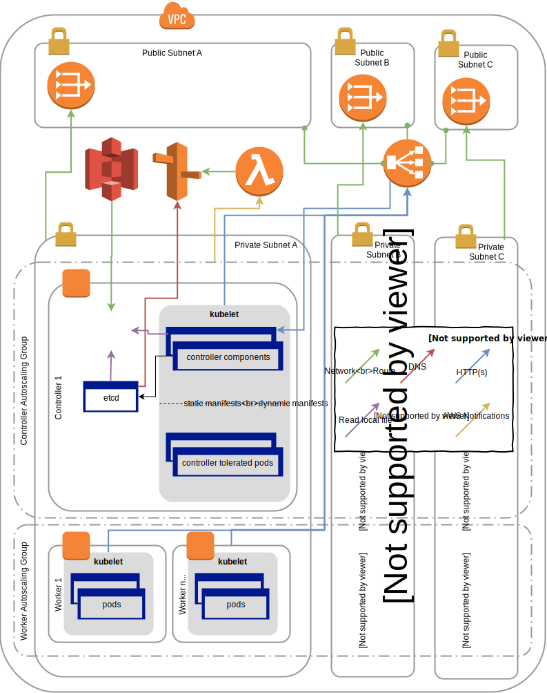

# Introduction
These days I'm helping [koko](https://itskoko.com/) to build their Kubernetes
infrastructure on AWS. Initially, we used kops to deploy the cluster but weren't
very happy. I've researched various option and [blogged about
them](/2017/12/15/production-grade-kubernetes/) earlier.

tl;dr: There aren't that many options that are secure, highly available and
don't require buying into a vendor ecosystem.

kubeadm is the official vendor independent solution to installer Kubernetes.
While it lacks automated setup of multi master clusters, [it's
possible](https://kubernetes.io/docs/setup/independent/high-availability/).

To have a reliable and reproducable way to build clusters, we decided to create
[Cloudformation](https://aws.amazon.com/cloudformation/) templates to fully
automate this setup.

All this is opend sourced and available on https://github.com/itskoko/kubecfn

## Architecture

The cluster consists of multiple components required for the cluster.

### Offline key generation
The first step to create a new cluster is [generating the TLS keys for etcd and
kubeadm](https://github.com/itskoko/kubecfn/blob/e3cf1d21db72ca5467ac6f43abc02c5871fd444a/Makefile#L84).
These credentials get uploaded to S3 and the instances get a IAM instance
profile with a [policy allowing it to download
them](https://github.com/itskoko/kubecfn/blob/e3cf1d21db72ca5467ac6f43abc02c5871fd444a/kubernetes.yaml#L759).

### Controller Instances
The controller instances are managed by an autoscaling group.

They are running etcd and the controller components like the apiserver,
scheduler and controller manager.
[ignition](https://coreos.com/ignition/docs/latest/) downloads the [TLS
keys](https://github.com/itskoko/kubecfn/blob/e3cf1d21db72ca5467ac6f43abc02c5871fd444a/kubernetes.yaml#L859)
and [sets up systemd units for kubelet and
etcd](https://github.com/itskoko/kubecfn/blob/e3cf1d21db72ca5467ac6f43abc02c5871fd444a/kubernetes.yaml#L978).

On initial cluster creation (`make create-cluster`), the ClusterState flag is
set to `new`, which enables etcd bootstrapping. To find the other etcd peers,
we're using SRV record based [DNS
Discovery](https://coreos.com/etcd/docs/latest/v2/clustering.html#dns-discovery).
This option give us one way to bootstap, as well as dynamically add and remove
members. On the other hand, the 'static' and 'etcd' discovery can be only used
for initial cluster configuration.

Unfortunately AWS can't automatically add DNS records for instances in an
autoscaling group. To solve this, we're using a lambda to update a route53 zone
(see next section).

Once etcd is up, `kubeadm init` creates the manifests and keys for the
controller components but use the pre-generated keys for the CA generated in the
first step. This makes sure all controller keys are signed with this trusted CA.

[An ELB](https://github.com/itskoko/kubecfn/blob/e3cf1d21db72ca5467ac6f43abc02c5871fd444a/kubernetes.yaml#L1158)
in front of the apiservers provide a stable endpoint for both the workers as
well as users of the cluster.

### Route53 Lambda
The cluster creates it's own Route53 zone, which needs to be a subdomain of the
given `ParentZoneID` parameter. Beside a record pointing to the apiserver ELB,
this zone is updated [by a
Lambda](https://github.com/itskoko/kubecfn/blob/e3cf1d21db72ca5467ac6f43abc02c5871fd444a/kubernetes.yaml#L643).

Each time a controller instances get added or removed by the autoscaling group,
the lambda gets triggered and adds/removes DNS records for etcd discovery.

### Workers
The worker setup is straight forward. It's also managed by an autoscaling group.
The ignition config downloads credentials for the kubelet from S3

### Conclusion and Caveats
kubecfn wasn't build by a big team nor as an end in itself. We focused on making
it easy to maintain, reliable and fail gracefully. That means there are some
[rough edges around
automation](https://github.com/itskoko/kubecfn/labels/automation). The security
[could be improved further](https://github.com/itskoko/kubecfn/labels/security)
and I'm not very happy with the whole concept of IAM instance profiles which
effectively grants these privileges to every process running on a host. We
mitigate this by installing
[kube2iam](https://github.com/itskoko/kubecfn/blob/e3cf1d21db72ca5467ac6f43abc02c5871fd444a/manifests/kube2iam.yaml)
but this isn't a robust as something like this should be. Unfortunately it's
current best practice and there isn't an easy way to improve. Let me know if you
know a better way.

There is also [the nasy
workaround](https://github.com/itskoko/kubecfn/blob/e3cf1d21db72ca5467ac6f43abc02c5871fd444a/kubernetes.yaml#L247)
of patching the kube-proxy configmap after `kubeadm init` which requires
upstream fixes.

That being said, thanks to CloudFormation with primitives like
[WaitOnResourceSignals](/2015/04/27/cloudformation-driven-consul-in-autoscalinggroup/)
and features like [Change Sets](https://github.com/itskoko/kubecfn#dry-run), I
feel more comfortable operating this cluster than I was with any other installer
I used in the past.
