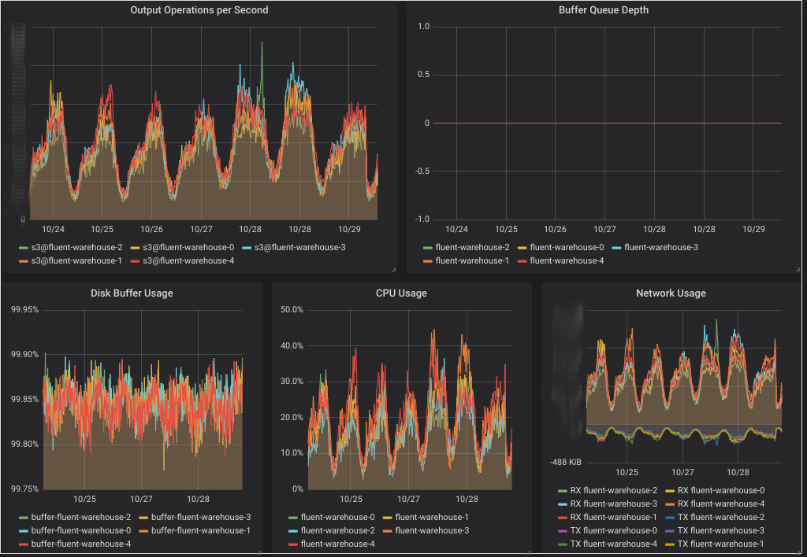

*Or how I replaced AWS Firehose by fluentd instances and saved >80% EC2 traffic
costs.*

# Using AWS Kinesis Firehose
[koko](https://www.koko.ai/) is one of my current clients. They are running on
the [Kubernetes
infrastructure I
built](/2018/02/01/kubecfn-cloudformation-installer-for-reasonably-secure-multi-master-kubernetes-cluster/)
earlier this year.
For analytics purposes with [AWS Athena](https://aws.amazon.com/athena/), the
backend services use [AWS Kinesis
Firehose](https://aws.amazon.com/kinesis/data-firehose/) to ship messages to S3.
Basically it receives messages via HTTP, batches them based on time or size and
uploads them to S3.

We isolated the Kubernetes VMs a VPC for security reasons, so they need to use a
NAT Gateway to connect to Kinesis Firehose. This was responsible for most of the
traffic handled by the NAT Gateways and made up a significant portion of the
monthly EC2 costs.  To allow systems in a VPC to reach AWS Services without
having to pass a NAT Gateway, AWS provides *VPC Endpoints* for various services.
Unfortunately not for Firehose.

Beside that, the files produced by Firehose still needed
processing to shard them by customer for efficient Athena querying, which
involved downloading the files from S3 to process them and upload them again.
Moreover, Firehose wasn't as reliable as we hoped.

We discussed introducing Kafka to process the streams, but ideally wanted to
avoid running a complex, distributed system like this. Fortunately, since
all messages shipped are independent of each other and get deduplicated in
Athena anyway, we shouldn't need expensive coordination. So what alternatives do
we have?

# Warehousing with Fluentd
Having introduced [fluentd](https://www.fluentd.org/) for shipping logs
recently, I realized it might check all the boxes.

Most people probably use [fluentd](https://www.fluentd.org/) for shipping logs.
These days it's the de facto standard for log shipping on Kubernetes. For that
it reads the local container logs and ships them to a central logging service,
like [Elasticsearch](https://www.elastic.co/products/elasticsearch). Then you'd
use something like [Kibana](https://www.elastic.co/products/kibana). That
completes the so called *EFK Stack*.

## Configuration
Fluentd allows use to define a source for receiving messages from the
application. Each message contains a shard key that's used as path prefix on S3.
Fluentd allows parsing this with a custom regexp:

```
<source>
  @type http
  port 8888
  bind 0.0.0.0
  body_size_limit 32m
  keepalive_timeout 10s
  <parse>
    @type regexp
    expression /^(?<path>[^\s]+) (?<content>.+)$/m
  </parse>
</source>
```

Now we can use the s3 output to send the messages to s3.
Since we need to batch up the files, we use a *file buffer*. This buffers the
messages to a local directory until either the `chunk_limit_size` or the
`timekey` is reached, after which the file gets uploaded to s3.

```
<match **>
  @type s3

  s3_bucket the-output-bucket
  s3_region us-east-1

  path ${path}
  s3_object_key_format "%{path}/#{Socket.gethostname}_%{time_slice}_%{index}.%{file_extension}"

  store_as gzip_command
  <buffer path,time>
    @type file
    timekey 3600
    chunk_limit_size 25MB
  </buffer>
  <format>
    @type single_value
    message_key content
  </format>
</match>
```

The `path` and `time` arguments to `<buffer path,time>` groups the chunks by
time and path. This allows us to set `s3_object_key_format` to add `path` to
the destination path as prefix when flushing the buffer to S3.

We also add the hostname to the destination path by using
`#{Socket.gethostname}`. This prevents conflicts when running multiple instance
without requiring any coordination between the instances. Since the messages are
independent of each other and their order is irrelevant, this is all we need to
process them in parallel.

## Monitoring


The
[fluent-plugin-prometheus](https://github.com/fluent/fluent-plugin-prometheus)
plugin provides metrics about the throughput and output buffer length which can
be used to alert on. The dashboard above also shows cAdvisor and kubelet metrics
for the fluent pods to monitor disk, CPU and network usage.

## Deployment
We deploy this on Kubernetes with a [Persistent
Volume](https://kubernetes.io/docs/concepts/storage/persistent-volumes/) for
each instance to persist the buffer even if a pod crashes or gets recreated.

Since a single instance of fluentd isn't able to handle the message throughput,
we need to run multiple instances. Since we use volumes, we need to use a
[StatefulSet](https://kubernetes.io/docs/concepts/workloads/controllers/statefulset/)
for this.

To have a endpoint for the application to connect to, we use a
[Service](https://kubernetes.io/docs/concepts/services-networking/service/)
which routes request in round robin. This means one message for a batch might
end up on a different instance than the next message, which fortunately is no
problem even without a complex, coordinated system like kafka.

## Conclusion
It took us just two days to implement and rollout this change and it's been
working well for several weeks now without requiring any maintenance so far. It
simplified the setup, removed the dependency on Firehose and cut over 80% of the
traffic costs.

Often the question running something yourself vs using a managed service. But
sometimes operating something simple yourself is better than using something
complex managed by a 3rd party.
