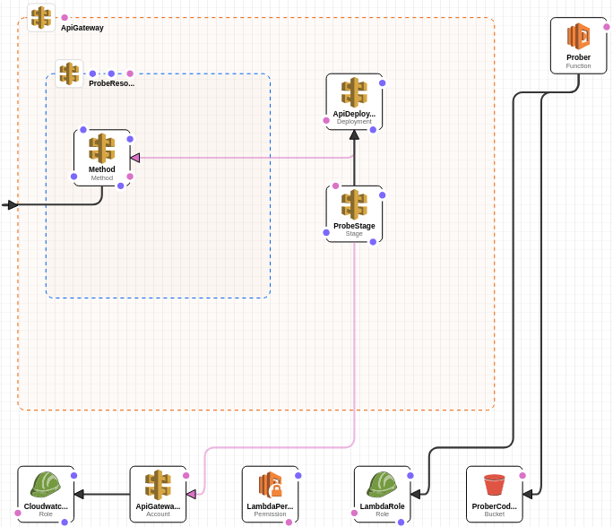
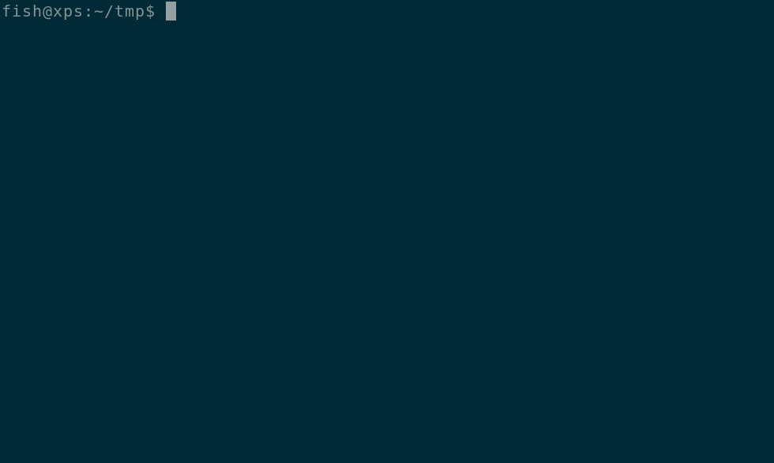
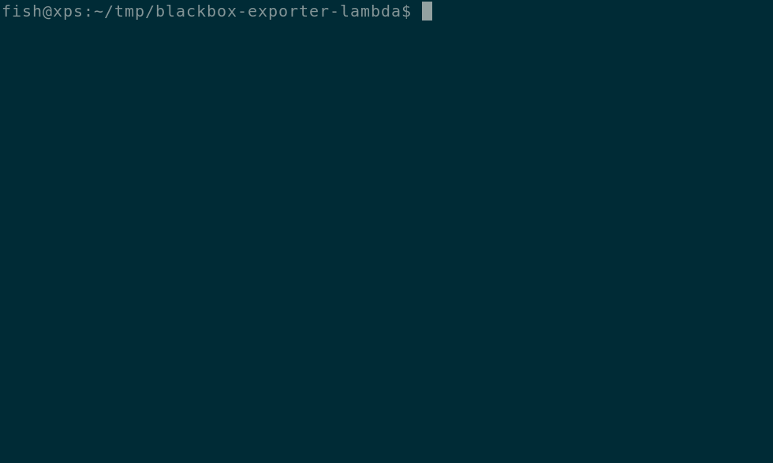
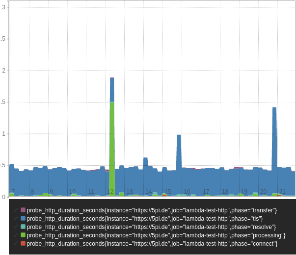

# Introduction


When providing any service to a global customer base, you are probably
interested in measuring the performance and availability of your site from
multiple global locations.

For this, I've created [latency.at](https://latency.at) which unfortunately
didn't get the traction I hoped it would. (See
[this](https://blog.latency.at/2018-05-24-shutting-down-latency-at/) for more
details).

So today, we're back where we were before: If you want your performance and
availability metrics in [Prometheus](https://prometheus.io) your best option is
to run a bunch of snowflake VMs with the prometheus blackbox exporter in
different regions and glue some authenticating reverse proxy to it.

Wouldn't it be nice if we could run this without having to mange servers? Like
server*less*?

Introducing
[blackbox-exporter-lambda](https://github.com/discordianfish/blackbox-exporter-lambda)!

# How does it work?
When working on latency.at, [I've
refactored](https://github.com/prometheus/blackbox_exporter/pull/214) the
blackbox-exporter to make it possible to use it's probers and config as packages
in downstream project.

This allowed me to create a new project which runs the probers on [AWS
Lambda](https://aws.amazon.com/lambda/).

The project contains [Cloudformation
templates](https://aws.amazon.com/cloudformation/) to create the Lambda and
expose it via the [Amazon API Gateway](https://aws.amazon.com/api-gateway/).

For authorization, we require an authorization header to match the `AUTH_TOKEN`
environment variable.

# Deployment
## Bootstrapping

Download or checkout the
[blackbox-exporter-lambda](https://github.com/discordianfish/blackbox-exporter-lambda) and change to the directory:

```
git clone https://github.com/discordianfish/blackbox-exporter-lambda.git
cd blackbox-exporter-lambda
```

Create the Cloudformation Stack. On the first run, this will create a S3 bucket
called `blackbox-exporter-[AWS AccountId]`. You might want to use a different
prefix for reach region you deploy this to.

This won't include the lambda since
we first need to upload the code.

```
make new
```

## Upload Code

Now upload the code. This uses the aws cli to get your Account ID. You can also
set this using the `ACCOUNT_ID` environment variable.

```
make upload
```

To finialize this and create the lambda run:
```
AUTH_TOKEN=foobar23 make update
```

`AUTH_TOKEN` specifies which auth token to require when handling requests. You
can make Prometheus use this token by configuring `bearer_token` in the [scrape
config](https://prometheus.io/docs/prometheus/latest/configuration/configuration/#scrape_config)

## Test Lambda

Now we can run `make endpoint` to get the URL to invoke the blackbox-exporter
and use curl for testing this. You use the `config` parameter for
blackbox-exporter configuration. Each probe takes different configuration
parameters. See the [blackbox-exporter configuration
documentation](https://github.com/prometheus/blackbox_exporter/blob/master/CONFIGURATION.md#http_probe)
for more details.

```
curl -L -G \
  -H 'Authorization: Bearer foobar23' \
  --data-urlencode 'target=https://www.google.com' \
  --data-urlencode 'config={"preferred_ip_protocol": "ip4"}' \
  $(make endpoint)/http
```

## Updates
To change the `AUTH_TOKEN` or roll out any other Cloudformation change, you can
run `AUTH_TOKEN=xx make update` again.

When changing the lambda code itself, run `make upload` to upload it to the code
bucket and run `make bump` to notify Lambda that the code base changed.

## Prometheus Configuration
The configuration is similar to the one used for the regular blackbox-exporter.
It also uses relabling to configure multiple targets easily:

```
- job_name: 'blackbox-exporter-lambda-us-central-1'
  metrics_path: /probe/http
  bearer_token: foobar23
  scheme: https
  params:
    config:
      - |
        preferred_ip_protocol: ip4
  static_configs:
    - targets:
      - https://5pi.de
      - https://www.google.com
  relabel_configs:
    - target_label: __param_target
      source_labels: [__address__]
    - target_label: instance
      source_labels: [__param_target]
    - target_label: __address__
      replacement: 5v5jaus0zj.execute-api.eu-central-1.amazonaws.com
```

Use your token for `bearer_token` and the output of `make endpoint` for the `__address__`
replacement and `metrics_path`. This should get you something like this:

**`probe_http_duration_seconds{instance="https://5pi.de",job="blackbox-exporter-lambda-us-central-1"}`**

