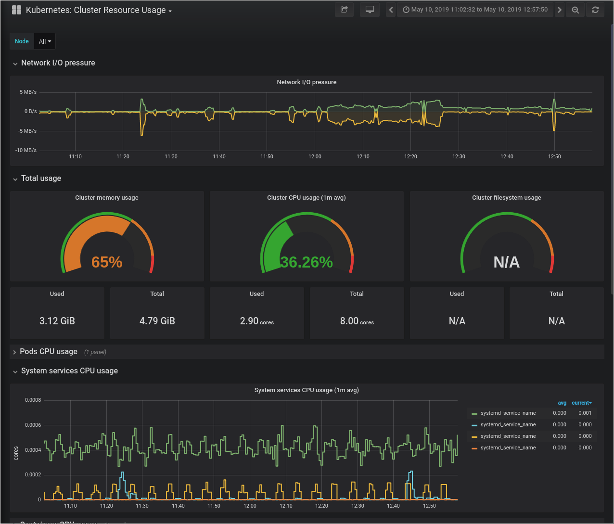

# Why..

*Me, better with clean software than clean hardware*

As you might know, I'm living in Berlin, Germany. Maybe you also know that [our
Internet is
slow](https://www.npr.org/2019/01/03/678803790/berlin-is-a-tech-hub-so-why-are-germanys-internet-speeds-so-slow).
But I finally found a cable internet provider which is supposed to deliver up to
400 MBit to my home. Unfortunately [their service seems to be really bad](https://www.trustpilot.com/review/pyur.com).

So instead of canceling my old DSL aka copper aka phone line based internet,
I'm using both for redundancy reasons.

To make use of both providers, I'd needed a new router.

About 13 years ago I came across [OpenWrt](https://www.openwrt.org) and loved
it. I've even made it my [final project as school (German)](router.pdf). So I
wanted to use it for this project again.

As hardware I wanted something that has enough power to do VPN and NAT
operations at line speed and has at least 3x 1GBit ports. After heaving heard
good things about "PC Engines" (thanks to [Michael
Stapelberg](https://twitter.com/zekjur) for the recommendation!), I've decided
to buy a [apu2d4](https://pcengines.ch/apu2d4.htm) with 16GB mSATA SSD.
Unfortunately there are no well supported and fast wifi chipsets, so I've
decided to use a Unifi AP for Wifi.

Setting this up was a matter of minutes:

1. Write openwrt `x86_64` image with `dd` to a USB drive
2. Boot the apu2 from it
3. Use `dd` to write USB drive to SSD

That's it. But now that I have this powerful router, I might as well run
[Prometheus](https://prometheus.io) and other services not directly related to
routing on it. I could run these directly on OpenWrt but that would require packaging them as OpenWrt packages and requiring to build everything from source to be properly integrated with their buildroot. This, and for all other reasons containers are great I want to run these things as container images.

# Custom Kernel
The default OpenWrt Kernel for `x86_64` doesn't include the necessary features,
so I had to build my own image. I've disabled some features I won't use and
enabled options for cgroups, namespaces, overlayfs and the required networking
options. You can find my config diff
[here](https://github.com/5pi-home/openwrt/blob/master/config) (created by
`./scripts/diffconfig.sh`). If you want to create your own image, you need the
following options:

**For process and resource isolation:**
```
CONFIG_KERNEL_BLK_CGROUP=y
CONFIG_KERNEL_CGROUPS=y
CONFIG_KERNEL_CGROUP_CPUACCT=y
CONFIG_KERNEL_CGROUP_DEVICE=y
CONFIG_KERNEL_CGROUP_FREEZER=y
CONFIG_KERNEL_CGROUP_PIDS=y
CONFIG_KERNEL_CGROUP_SCHED=y
CONFIG_KERNEL_CPUSETS=y
CONFIG_KERNEL_DEVPTS_MULTIPLE_INSTANCES=y
CONFIG_KERNEL_FAIR_GROUP_SCHED=y
CONFIG_KERNEL_FREEZER=y
CONFIG_KERNEL_IPC_NS=y
CONFIG_KERNEL_KEYS=y
CONFIG_KERNEL_LXC_MISC=y
CONFIG_KERNEL_MEMCG=y
CONFIG_KERNEL_NAMESPACES=y
CONFIG_KERNEL_NETPRIO_CGROUP=y
CONFIG_KERNEL_NET_CLS_CGROUP=y
CONFIG_KERNEL_NET_NS=y
CONFIG_KERNEL_PID_NS=y
CONFIG_KERNEL_POSIX_MQUEUE=y
CONFIG_KERNEL_PROC_PID_CPUSET=y
CONFIG_KERNEL_RESOURCE_COUNTERS=y
CONFIG_KERNEL_SECCOMP=y
CONFIG_KERNEL_SECCOMP_FILTER=y
CONFIG_KERNEL_USER_NS=y
CONFIG_KERNEL_UTS_NS=y
```

**For networking:**
```
CONFIG_PACKAGE_ip-bridge=y
CONFIG_PACKAGE_ip-full=y
CONFIG_PACKAGE_ipset=y
CONFIG_PACKAGE_iptables-mod-conntrack-extra=y
CONFIG_PACKAGE_iptables-mod-extra=y
CONFIG_PACKAGE_iptables-mod-ipopt=y
CONFIG_PACKAGE_kmod-asn1-decoder=y
CONFIG_PACKAGE_kmod-br-netfilter=y
CONFIG_PACKAGE_kmod-ikconfig=y
CONFIG_PACKAGE_kmod-ipt-conntrack-extra=y
CONFIG_PACKAGE_kmod-ipt-extra=y
CONFIG_PACKAGE_kmod-ipt-ipopt=y
CONFIG_PACKAGE_kmod-ipt-ipset=y
CONFIG_PACKAGE_kmod-ipt-raw=y
CONFIG_PACKAGE_kmod-iptunnel=y
CONFIG_PACKAGE_kmod-nf-conntrack-netlink=y
CONFIG_PACKAGE_kmod-nf-ipvs=y
CONFIG_PACKAGE_kmod-nfnetlink=y
CONFIG_PACKAGE_kmod-nls-base=y
CONFIG_PACKAGE_kmod-udptunnel4=y
CONFIG_PACKAGE_kmod-udptunnel6=y
CONFIG_PACKAGE_kmod-veth=y
CONFIG_PACKAGE_kmod-vxlan=y
CONFIG_PACKAGE_libnetfilter-conntrack=y
CONFIG_PACKAGE_libnfnetlink=y
```

The required `overlayfs` module for the container engines storage driver should
be already enabled.

## Build it yourself
To build your own image, start by cloning `git@github.com:openwrt/openwrt.git`
and run `./scripts/feeds update -a` to include the package feeds.

Then run `make menuconfig` to set your target hardware, exit again and run `make
defconfig`. That will set the default config for the target hardware.

Now you can either run `make menuconfig` again and select the options from above
manually or just edit `.config` to paste the options from above.

After that you should be able to build your image by running `make`.

You should save the output of `./scripts/diffconfig.sh` somewhere so be able to
recreate your image in the future.

Now it's time to upgrade OpenWrt. I just `scp` the image to the router and use
[sysupgrade](https://openwrt.org/docs/guide-user/installation/sysupgrade.cli) to
apply the new image.

If you still have trouble starting docker you can run Docker's [check-config.sh
script](https://github.com/moby/moby/blob/master/contrib/check-config.sh) to
make sure all necessary features are enabled. You'd need to install bash first
and have `CONFIG_PACKAGE_kmod-ikconfig=y` enabled.

## Automate it
There is nothing more frustrating than having such setup run for a few month,
then need to change something and realize there is no way to reproduce what you
did without starting all over. Many thing we learned when building resilient
infrastructure at scale can be applied at home too. Therefor [I've codified the
setup and added it to CI](https://github.com/5pi-home/openwrt).
All I need to upgrade is bumping the version in the
[Dockerfile](https://github.com/5pi-home/openwrt/blob/master/Dockerfile#L14) and
wait for CircleCI to get a new OpenWrt image.

# Packaging
## Docker
Initially I thought, all I want is Docker. And while it's possible to use just
extract the official Docker binaries to /usr/bin and bring up Docker that way,
using proper packages for OpenWrt's `opkg` package manager is a cleaner
solution. For that I've created
[docker-on-openwrt](https://github.com/discordianfish/docker-on-openwrt) which
creates a `opkg` package for docker from the official Docker binaries and adds
an init script and config to it. You can check it out and run `make` to build it
yourself or one of use my
[releases](https://github.com/discordianfish/docker-on-openwrt/releases).

## Kubernetes (k3s)
But then [k3s](https://k3s.io/) was born. It's lightweight Kubernetes which
replaces etcd3 by sqlite3 which trades high availability by easier operations.
It also includes containerd, so no need to install Docker.

I already blogged about [why Kubernetes makes sense at small
scale](/2018/12/18/why-kubernetes-at-small-scale/), so this seems perfect!

Similar to the Docker packages, I've created
[k3s-openwrt](https://github.com/discordianfish/k3s-openwrt) which builds
OpenWrt packages from k3s binaries. Again, feel free to use my
[releases](https://github.com/discordianfish/k3s-openwrt/releases) if you don't
want to build it yourself.

Depending on your setup, you might need to configure your firewall properly to
allow traffic from and to the pod network. In my case I've created a new
interface definition for the cni0 interface:

**/etc/config/network**:
```
config interface 'k8s'
	option proto 'none'
	option ifname 'cni0'
```

And a zone which allows input/output/forward traffic:
**/etc/config/firewall**:
```
config zone
	option name 'k8s'
	option input 'ACCEPT'
	option output 'ACCEPT'
	option forward 'ACCEPT'
	option network 'k8s'
```

# Summary

All this turned out to be very useful. It was never more fun to build things for
my home network. I'm running an ingress controller with the wildcard DNS record
`*.d.42o.d` pointing to it, which means I can just create an ingress
`foo.d.42o.de` for a new service without having to update DNS records.

You might ask what services could I possibly be reasonable to run here. Here is
what I managed to squeeze on this box:

- unifi-controller
- Prometheus, not only monitoring my systems but also temperature, humidity and
  air pressure using [mouldy](https://github.com/vonneudeck/mouldy)
- Grafana for nice dashboards
- openhab2 to integrate 433Mhz RF sockets with Amazon Alexa
- Plex with sonarr, radarr and nzbget

While I spend a few days getting the setup working, this works so reliable so
far, that it might actually pay off going forward.

Next I've planned to switch all services to HTTPS because it's about damn time
to stop using HTTP event at home. Thanks to [let's encrypt](https://letsencrypt.org/) and [cert-manager](https://github.com/jetstack/cert-manager) that should be feasible.
