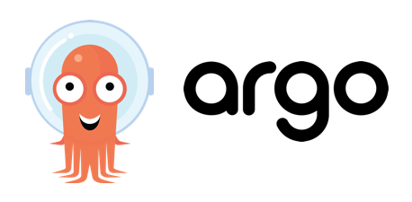
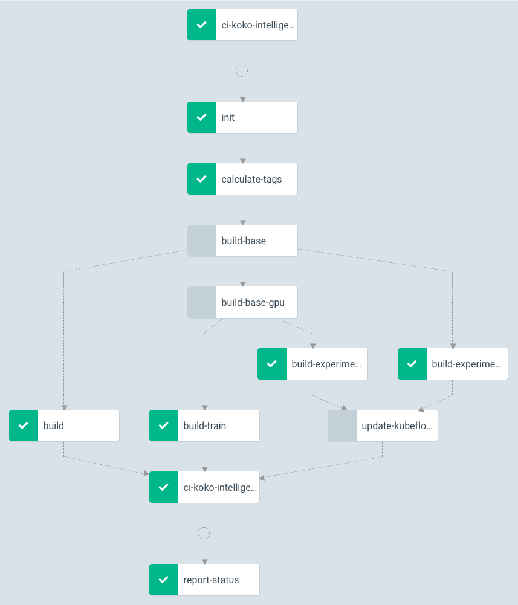

# Introduction
As I discussed in [Why Kubernetes at small
scale](/2018/12/18/why-kubernetes-at-small-scale/), Kubernetes is
more an infrastructure framework than just a container scheduler.

Every resource in your infrastructure is a Kubernetes Object and new Resources
can be defined using [Custom Controllers and
Resources](https://kubernetes.io/docs/concepts/extend-kubernetes/api-extension/custom-resources).

## Argo
One of the custom controllers I'm most excited about
[Argo](https://argoproj.github.io/). It extends the Kubernetes API by providing
a [Workflow
Object](https://github.com/argoproj/argo/tree/master/examples#welcome) in which
each task is a command running in a container. It supports defining dependencies,
control structures, loops and recursion and parallelize execution. To capture
workflow artifacts, it supports [various
backends](https://argoproj.github.io/docs/argo/configure-artifact-repository.html).

I've built the machine learning / training infrastructure for [one of my
clients](/case-studies/koko/) around Argo with great success. So when we looked
into options for CI/CD, we doubled down on Argo and build that on top of it as
well.

Argo already supports git input artifacts, as shown in this example:

```
apiVersion: argoproj.io/v1alpha1
kind: Workflow
metadata:
  generateName: input-artifact-git-
spec:
  entrypoint: git-clone
  templates:
  - name: git-clone
    inputs:
      artifacts:
      - name: argo-source
        path: /src
        git:
          repo: https://github.com/argoproj/argo.git
          revision: "v2.1.1"
    container:
      image: golang:1.10
      command: [sh, -c]
      args: ["git status && ls && cat VERSION"]
      workingDir: /src
```

## k8s-webhook-handler
Creating a workflow to build a code repository is straight forward. But how to
do it automatically when you push new code to GitHub?

There is [argo-events](https://github.com/argoproj/argo-events/) but it was in
very early development and seemed concerned with many things beyond what we
needed. There also exists [argo-ci](https://github.com/argoproj/argo-ci) but
that project got stale and since was removed from the official argo docs.

So I've created the
[k8s-webhook-handler](https://github.com/airbnb/k8s-webhook-handler)[^1]. It's a
webhook-handler that handles incoming webhooks from GitHub by checking out a
Kubernetes manifests (`.ci/workflow.yaml` by default) and applies it to
Kubernetes with the following annotations set:

- `k8s-webhook-handler.io/ref`: Git reference (e.g. refs/heads/master)
- `k8s-webhook-handler.io/revision`: The SHA of the most recent commit on ref after the push.
- `k8s-webhook-handler.io/before`: The SHA of the most recent commit on ref before the push.
- `k8s-webhook-handler.io/repo_name`: Repo name including user (e.g. airbnb/k8s-webhook-handler)
- `k8s-webhook-handler.io/repo_url`: git URL (e.g. git://github.com/airbnb/k8s-webhook-handler.git)
- `k8s-webhook-handler.io/repo_ssh`: ssh URL (e.g. git@github.com:airbnb/k8s-webhook-handler.git)
- `k8s-webhook-handler.io/event_type`: Event type (e.g. `push` or `delete`)
- `k8s-webhook-handler.io/event_action`: Event type specific action (e.g. `created` or `deleted`)

This is kept very generic. You could use this to apply any kind of resource but
we're using it to submit an Argo workflow.

# CI workflow

## Building binaries
Now we can create an Argo Workflow that uses the annotations to checkout the code
as the desired revision and build it. Let's take the k8s-webhook-handler itself
as an example.

First we need to create `.ci/workflow.yaml` in the repository:

```
apiVersion: argoproj.io/v1alpha1
kind: Workflow
metadata:
  generateName: ci-k8s-webhook-handler-
spec:
  entrypoint: build
  templates:
    - name: build
      inputs:
        artifacts:
          - name: source
            path: /src
            git:
              repo: "{{workflow.annotations.k8s-webhook-handler.io/repo_ssh}}"
              revision: "{{workflow.annotations.k8s-webhook-handler.io/revision}}"
      container:
        image: golang:1.14
        command: ["go", "install", "./..." ]
        workingDir: /src
      outputs:
        artifacts:
        - name: binaries
          path: /go/bin
```

Now the repository needs to be configured to send webhook requests for push
events to the k8s-webhook-handler as described in the [GitHub
Docs](https://developer.github.com/webhooks/creating/).

If we push code to the repository now, it will execute the workflow above to
checkout the code, build it and capture the build artifacts in Argo's artifacts
repository.

## Building Docker images with Kaniko


Now we have binaries but running everything on Kubernetes means we need
docker/container images. There is [no native build support in
Kubernetes](https://github.com/kubernetes/kubernetes/issues/1806) and the
suggested solution is using unprivileged build tools.

We opted for [Kaniko](https://github.com/GoogleContainerTools/kaniko). It
supports the Dockerfile format our developers are familiar with and doesn't
require any elevated permissions, making it possible to run in a regular
Kubernetes pod.

<aside>Caveat: Since Kaniko runs unprivileged, it can't use layered filesystems
like Docker does, it needs to copy the files after each step which is slower
when many files are involved. A better solution for this would be
adding build primitives like the ability of snapshotting image layers to the
Kubernetes API.</aside>

Now with Kaniko we can use the following workflow to build the
k8s-webhook-handler Dockerfile:

```
apiVersion: argoproj.io/v1alpha1
kind: Workflow
metadata:
  generateName: ci-k8s-webhook-handler-
spec:
  entrypoint: build
  volumes:
    - name: docker-config
      configMap:
        name: docker-config
  templates:
    - name: build
      metadata:
        annotations:
          iam.amazonaws.com/role: ci-role
      inputs:
        artifacts:
          - name: source
            path: /src
            git:
              repo: "{{workflow.annotations.k8s-webhook-handler.io/repo_ssh}}"
              revision: "{{workflow.annotations.k8s-webhook-handler.io/revision}}"
      container:
        image: gcr.io/kaniko-project/executor
        args:
          - "--context=/src"
          - "--destination=xxx.dkr.ecr.us-east-1.amazonaws.com/k8s-webhook-handler:{{workflow.annotations.k8s-webhook-handler.io/revision}}"
        volumeMounts:
          - name: docker-config
            mountPath: /kaniko/.docker/
```
Since we're using ECR, the docker-config volume just contains `config.json` with
the content `{ "credsStore": "ecr-login" }` to make kaniko use the `ecr-login`
credential helper. See the [kaniko
docs](https://github.com/GoogleContainerTools/kaniko#pushing-to-different-registries)
for more details. To grant the pod IAM permissions to do that, we're using
[kube2iam](https://github.com/jtblin/kube2iam) and the `iam.amazonaws.com/role`
annotation.

## Deployment
Now we got a image, but how to deploy it? Argo supports workflows that consist
of a list of steps or a
[DAG](https://en.wikipedia.org/wiki/Directed_acyclic_graph). While a list of
steps would be sufficient for a simple build-then-deploy workflow, we generally
prefer DAGs for their flexibility, so let's use it in this example as well.

```
apiVersion: argoproj.io/v1alpha1
kind: Workflow
metadata:
  generateName: ci-k8s-webhook-handler-
spec:
  entrypoint: ci
  serviceAccountName: ci-workflow
  arguments:
    parameters:
      - name: image
        value: "xxx.dkr.ecr.us-east-1.amazonaws.com/k8s-webhook-handler:{{workflow.annotations.k8s-webhook-handler.io/revision}}"
  volumes:
    - name: docker-config
      configMap:
        name: docker-config
  templates:
    - name: ci
      dag:
        tasks:
          - name: build
            template: build
          - name: deploy
            template: deploy
            dependencies: [build]
    - name: build
      metadata:
        annotations:
          iam.amazonaws.com/role: ci-role
      inputs:
        artifacts:
          - name: source
            path: /src
            git:
              repo: "{{workflow.annotations.k8s-webhook-handler.io/repo_ssh}}"
              revision: "{{workflow.annotations.k8s-webhook-handler.io/revision}}"
      container:
        image: gcr.io/kaniko-project/executor
        args:
          - "--context=/src"
          - "--destination={{workflow.parameters.image}}"
        volumeMounts:
          - name: docker-config
            mountPath: /kaniko/.docker/
    - name: deploy
      container:
        image: bitnami/kubectl:1.17.4
        args: ["kubectl", "set", "image", "deployment/k8s-webhook-handler", "k8s-webhook-handler={{workflow.parameters.image}}"]
```

This workflow defines a DAG in the `ci` template with two tasks where deploy
depends on build, so it runs after that. To allow the workflow to change
resources in Kubernetes, we specify `serviceAccountName: ci-workflow`. Follow
the [Kubernetes
Docs](https://kubernetes.io/docs/tasks/configure-pod-container/configure-service-account/)
for details on how to create service accounts.

On push, this workflow will now build the image and update the
`k8s-webhook-handler` container in the `k8s-webhook-handler` deployment to use
the new image.

## Branch based continuous integration
The above example would update the `k8s-webhook-handler` in the default
namespace on every push, no matter which branch. It also doesn't handle the
initial creation of the deployment. That's probably not what you want in
production.

What we are doing is using a custom deployment image with scripts
that render templates from the source repository. Beside using the image name
from the workflow in the deployment manifests, we deploy all resources in a
Kubernetes namespace based on the branch name. This allows developers to test
their changes in a separate namespace before merging and deploying to the
production namespace.

But what happens if a developer deletes their branch? k8s-webhook-handler
supports any kind of GitHub events, so we actually send many more events to it
and use the `k8s-webhook-handler.io/event_type` annotations to distinguish
between them. That allows us to run a separated `push` and `delete` DAG in the
workflow:

```
...
  templates:
    - name: ci
      dag:
        tasks:
          - name: push
            template: push
            when: "'{{workflow.annotations.k8s-webhook-handler.io/event_type}}' == 'push'"
          - name: delete
            template: delete
            when: "'{{workflow.annotations.k8s-webhook-handler.io/event_type}}' == 'delete'"
    - name: push
      dag:
        tasks:
          - name: build
            template: build
          - name: deploy
            template: deploy
            dependencies: [build]
    - name: delete
      container:
        image: custom-ci-tools-image
        command: [ "delete-namespace-for-ref", "{{workflow.annotations.k8s-webhook-handler.io/ref}}"]
...
```

## Advanced builds, GitHub checks, Slack notifications and more
The generic nature of the Argo workflow allows it to handle pretty much any build
and deployment needs. We have additional steps that use our custom ci scripts
to:

- Ensure the ECR repositories exist
- Sending build notifications to Slack and update [GitHub's status
  checks](https://help.github.com/en/github/collaborating-with-issues-and-pull-requests/about-status-checks)
- Add deployment annotations to our monitoring system
- Calculate image tags based on file checksums to avoid unnecessary builds

Here is an example of one of our more sophisticated CI workflows that builds
multiple variants of an project based on multiple base images, to support GPU
and non-GPU deployments:


- *init* adds a GitHub status check indicating that the build is running
- *calculate-tags* creates checksums from various files to determine what needs to
  get rebuild which leads to skipping rebuild of both base images
- *update-kubeflow* adds new Jupyter notebook builds to kubeflow
- *report-status* updates the GitHub status check and notifies Slack

# Conclusion
Argo is a relatively small but very powerful extension of the Kubernetes API.
I've been using various CI/CD systems over the years and while most are easier
to use for simple use cases, things tend to get tedious for more advanced and
less anticipated use cases. Argo gets away with much less complexity than most
of these systems as well, since all the heavy lifting of scheduling and
abstraction of build steps is done by Kubernetes. It's a shining example of what
is so great about Kubernetes: It's not just the datacenter as a computer idea,
but also the building blocks that *are* complex but only need to be solved once,
by Kubernetes, to benefit many different use cases on top of it.

---
[^1]: <small>Koko has been acquired by Airbnb where a modified version of this
  CI setup is still being used.</small>

