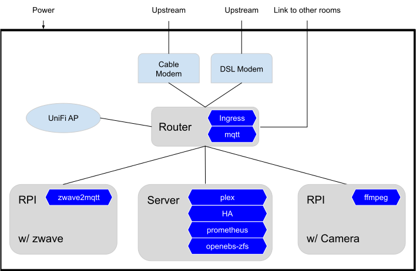
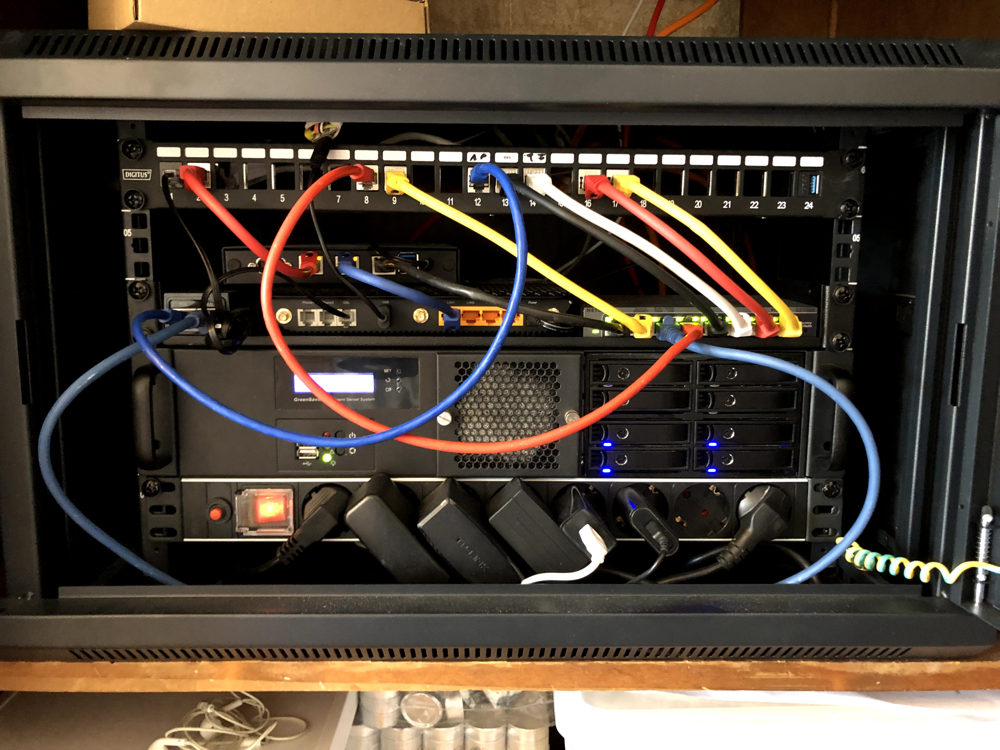

**Disclaimer:** *While writing this article, I realize I could use Affiliate
Links to the stuff I bought. So I gave it a try. Lemme know if that bothers
you*.

I've been running [Kubernetes on
OpenWrt](/2019/05/10/k8s-on-openwrt/) at home for two years now.
Although I already believed that [Kubernetes makes sense at small
scale](/2018/12/18/why-kubernetes-at-small-scale/) this was
intended as experiment about how small it can be.

What started as a silly experiment turned out to be totally worth it.
This has been to be the most reliable and convient to manage home (lab)
infrastructure I have been running.

There were issues for sure, but putting my efforts into building a reliable
Kubernetes infrastructure that allows to cleanly deploy and remove applications
at will was a great improvement over all a typial, manual and distribution
specific homelab setup that required me to "start over" quite frequently.

Beside that, it's also the ideal test bed to experiment with novel configuration
and automation strategies as well as explore Kubernetes edge cases. If something
works under the constraints of a homelab setup, it will work for your cloud
native apps on the usual platforms as well.

Of course we're not talking about scaling edge cases with 1k
node cluster sizes

While running everything on my OpenWrt router served me well so far, I need more
disk space and want to run more applications. So I decided to double down on
my Kubernetes-At-Home setup and start a blog series about it.

This is the first part talking about the hardware and storage setup.

## Hardware

While I'd love to have a full rack with real network gear and servers as much as
the next nerd, I'd find that extremly wasteful. Therefor my first goal is that
this setup should use as little power as possible.

Secondly, I still live for rent in Berlin so a small physical footprint was
another consideration.

  
Therefor I went with this small(ish) 19" Wall Mount Network Cabinate.
  The maximum installation depth is just 32cm though, so a extra short server case
  is needed. Unfortunately it doesn't seem to be available on US Amazon but there
  are plenty of other options like <a href="https://amzn.to/3t3uzXe">this</a>
  

  

  
  

  
I found this server case which is just 25cm deep.
That case fits mini ITX boards only which is fine for a low power board.
Unfortunately I can't find anything similar on US Amazon. This was also the
hardest to find component. So if you have the space, just go with a bigger rack
and case

  

  

  
I've decided to use the Super Micro A2SDi-2C-HLN4F-B
has Intel Atom C3338 onboard which should be sufficent and has a TDP of just 9W.
It supports 8 SATA3 ports which allows me to connect plenty of disks.
and can power it directly from 12V,
so bought a <a href="https://amzn.to/3gR28sU">80W 12V MeanWell PSU</a> (<a href="https://amzn.to/2RafV3d">DE</a>)
  

  

  
 (<a href="https://amzn.to/3nBPuzC">DE</a>)
  

  
To house the disks I bought a ICY BOX 8x 2.5" Backplane which fits the 2u 5.25" drive
bay, currently with 4x5TB disks and enough room for upgrades
  

  

  
  

Also bought patch panel, PDU and a tray to mount the non-rackable equipment.

Finally all my equipment is nice and tidy contained in the cabinate with just
two uplink connect, the link to the other rooms and a power input draining
typically around 60W.

## Kubernetes Storage
The Kubernetes setup itself hasn't changed much since my first blog article about [Kubernetes on
OpenWrt](/2019/05/10/k8s-on-openwrt/). To make use of the new storage I've
decided to run [ZFS](https://wiki.debian.org/ZFS) and use [OpenEBS' Local
PV](https://docs.openebs.io/docs/next/localpv.html) provisionier. As the name
implies, this is not a networking filesystem. Your pods effectivly get pinned to
whereever the PV gets created. That means in my case, all pods requesting
storage end up on this server. Still much better than using static hostPath
mounts as I did before and more appropriate than a brittle network filesystem.
But I might explore that eventually.

## Next: Software
In the next part of this series I'll talk about what I spent most time on in
this iteration: Using [jsonnet]() and
[k8s-alpha](https://jsonnet-libs.github.io/k8s-alpha/) to generate all
configuration in a way that is hopefully reusable on any Kubernetes home (lab)
setup. Stay tuned!
