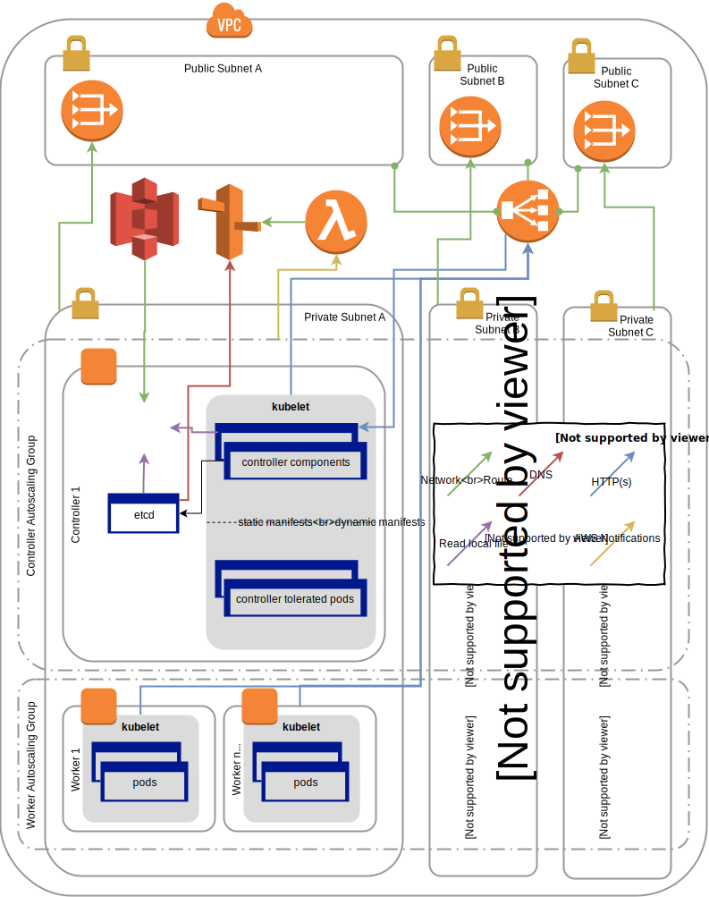
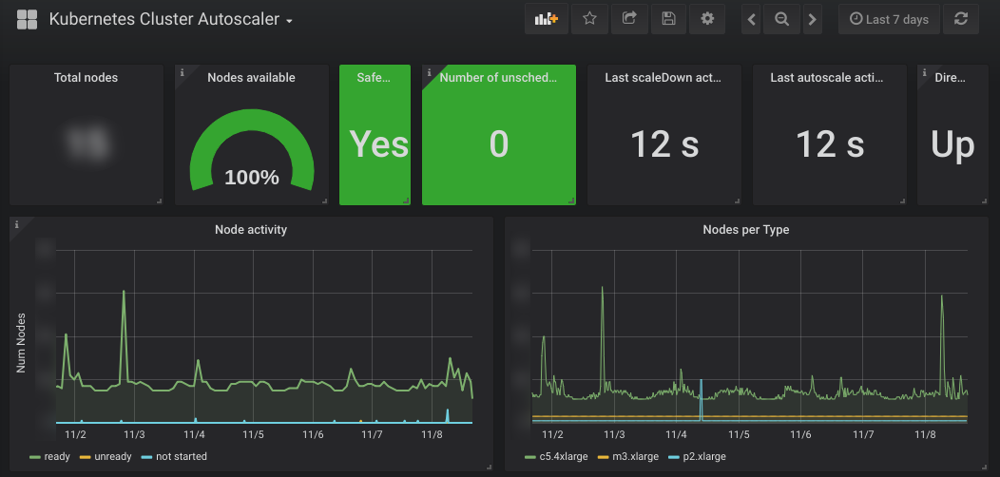
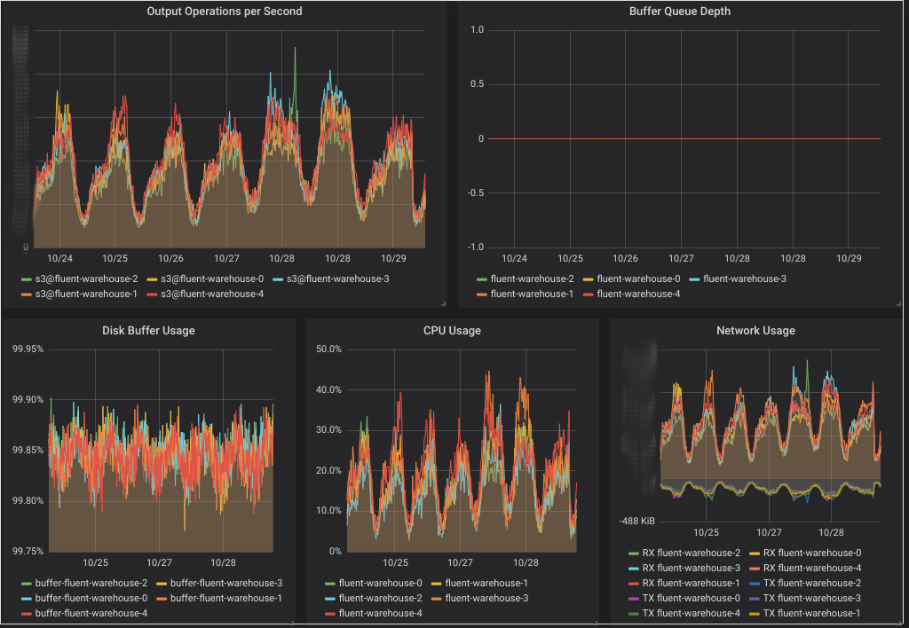

From legacy infrastructure to over 100 million content moderation decisions per
day and [acquired by Airbnb](https://www.businessinsider.com/airbnb-quietly-acquired-an-ai-content-moderation-startup-in-2018-2020-1).

Building an agile cloud native infrastructure for a high velocity AI based
content moderation startup.

<!--end-->

<blockquote class="testimonial">
  
  <code>Working with Johannes enabled us to dramatically accelerate product
development by having the rest of the engineering team focus 100% on feature
development, deploying many times a day despite supporting a very high
throughput application.
  </code>
  <footer><cite>Kareem Kouddous, CTO at Koko AI</cite></footer>
</blockquote>

## About Koko

The Internet can be a scary place. Koko keeps your community safe by using AI to
identify bad actors and damaging content. Koko detects issues in real time and
notifies your moderation system.

Koko was used by several top online communities to support over 100
million moderation decisions per day and was [acquired by Airbnb](https://www.businessinsider.com/airbnb-quietly-acquired-an-ai-content-moderation-startup-in-2018-2020-1) in 2018.

## Rancher to Kubernetes migration
When Koko contacted me, their infrastructure was running on an old version of
[Rancher](https://rancher.com/) which should be replaced by a Kubernetes
cluster. I've migrated all deployment manifests to Kubernetes manifests and
wrote scripts for [CircleCI](https://circleci.com/) to continuously deploy code
changes to the cluster. New branches get deployed to their own namespace with
own ingresses to allow developers to worker independently while also allowing
cross team and code base feature work.

To cleanup existing branches, I've developed
[k8s-ci-purger](https://github.com/itskoko/k8s-ci-purger) which cleans up
Kubernetes resources on branch deletion.

Since self-service is paramount, Koko needed a safe and reliable way for
developers to use internal services. This was solved by using
[oauth2\_proxy](https://github.com/bitly/oauth2_proxy) to authenticate against
GitHub. Additional changes to support Websockets for Jupyter Notebooks were
added.

## kubecfn - Cloudformation Kubernetes Installer

Initially, Koko used [kops](https://github.com/kubernetes/kops) to deploy the
Kubernetes cluster. Customizing Kubernetes component configuration often
required upstream changes in a rapidly evolving code base. That didn't only
slowed us down but also caused reliability issues due the dependency on unstable
versions. After investigating alternatives, which I also [blogged
about](https://5pi.de/2017/12/15/production-grade-kubernetes/), I proposed to
create a [Cloudformation](https://aws.amazon.com/cloudformation/) based
Kubernetes Installer around
[kubeadm](https://kubernetes.io/docs/setup/independent/). The safety
first-design gave us the confidence required to quickly iterate by ensuring safe
rollouts of version and configuration changes.
The project was made open source and can be [found
here](https://github.com/itskoko/kubecfn)

## Argo Machine Learning Pipeline
The next thing to solve was how to run machine learning pipelines on the new
cluster. There are several options but [Argo](https://github.com/argoproj/argo)
seemed like the best fit. Being a generic workflow engine it extends the
existing Kubernetes API allowing developers to use the same API and declarative
manifests to run the pipelines.

The custom built Kubernetes installer made it easy to add another GPU-enabled worker
instance group that automatically gets scaled up when a Argo pipeline requires
GPU instances and back to zero after the jobs finished.

## Autoscaling

As in most infrastructures, Koko's traffic pattern is diurnal with much higher
traffic during the (US) day than the night. Due to the nature of the service, it
fluctuates even more with short peaks and troughs when customers batch process
workloads. While Kubernetes provides simple CPU based autoscaling out the box,
this wasn't sufficient to scale up quickly enough while preventing it from scale
down too early when a customer briefly stops sending requests.

To solve that, I've introduced the [Prometheus Monitoring
System](https://prometheus.io/) and used
the
[k8s-prometheus-adapter](https://github.com/DirectXMan12/k8s-prometheus-adapter)
to provide the metrics as Kubernetes Custom Metrics. This allowed me to create
scaling rules for rapid scaling up while preventing underprovisioning by looking
at past traffic patterns.

## Observability
Koko used [Datadog](https://www.datadoghq.com/) for monitoring and, once it was
available, logging too. Since we weren't very happy with the service and
struggled to integrate custom metrics as well as metrics provided by
infrastructure services, we decided to move all our monitoring to Prometheus.
I've introduced [Grafana](https://grafana.org/) with statically provisioned and
CI deployed dashboards for system and infrastructure metrics, while also
allowing developers to create their own dashboards ad-hoc, allowing for a
self-service monitoring experience. I've built
[prometheus-renderer](https://github.com/itskoko/prometheus-renderer) to render
alerting expressions to provide graph previews in our slack alerts.

Since no logging services provided structured logging at a reasonable price,
I've integrated the [AWS Elasticsearch
Service](https://aws.amazon.com/elasticsearch-service/) with
[fluent-bit](https://fluentbit.io/) which allowed us to browse, filter and graph
logs as well as integrate them into Grafana dashboards.

## Stream processing

When Koko's API receives content to classify, it needs to archive to S3 them for
running machine learning on it. Initially [AWS Kinesis
Firehose](https://aws.amazon.com/kinesis/data-firehose/) was being used for
that. That allowed buffering and batching the data, even though further
processing to shard the data was necessary. Since it also doesn't support [VPC
Endpoints](https://docs.aws.amazon.com/vpc/latest/userguide/vpc-endpoints.html)
Koko incurred high traffic costs.

I've proposed and implemented a custom solution by using
[fluentd](https://www.fluentd.org/) and Kubernetes statefulsets to replace
Kinesis Firehose. This reduced Koko's EC2 traffic costs by 80%. You can read
more about the details in [this blog article](/2018/10/31/fluentd-for-data-warehousing-with-athena/).

## Conclusion
Koko's ability to rapidly and reliably build new features helped it to attract
some of the largest social networks.

I'm proud to have built the infrastructure that allowed Koko to be confident in
change and deliver it fast, ultimately helping them to get [acquired by Airbnb](https://www.businessinsider.com/airbnb-quietly-acquired-an-ai-content-moderation-startup-in-2018-2020-1).

Do you want to accelerate your product development by building upon or migrating
to modern cloud native infrastructure? [Let me know!](/hire-me).
